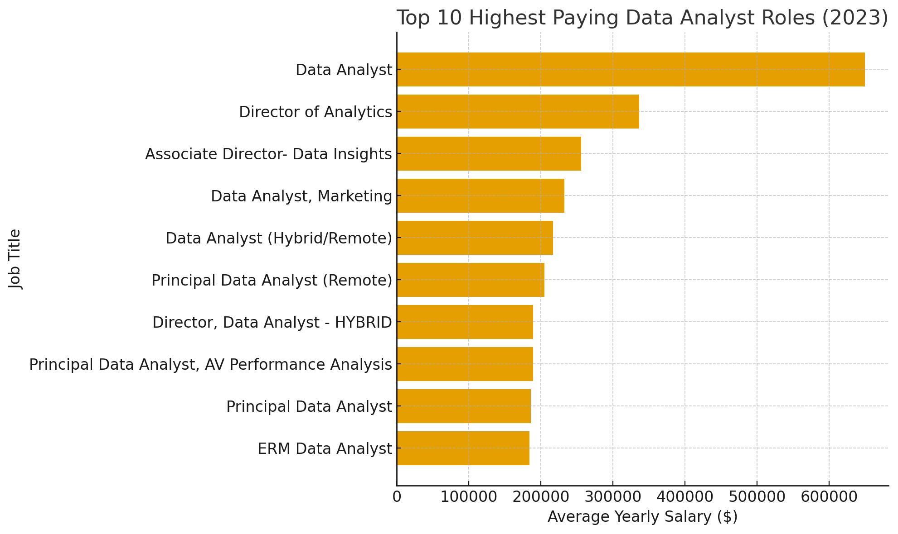
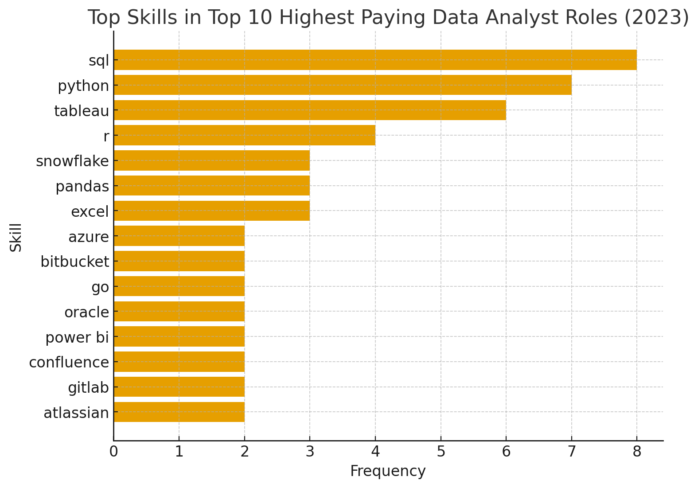
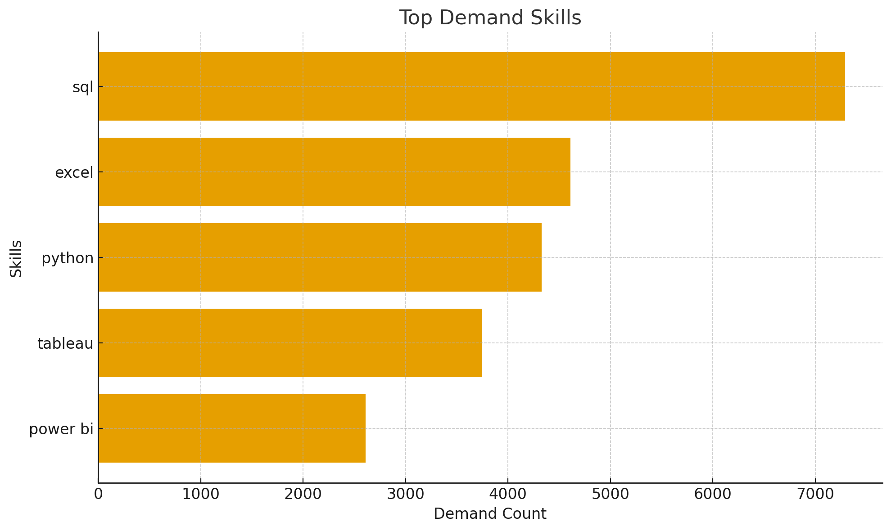
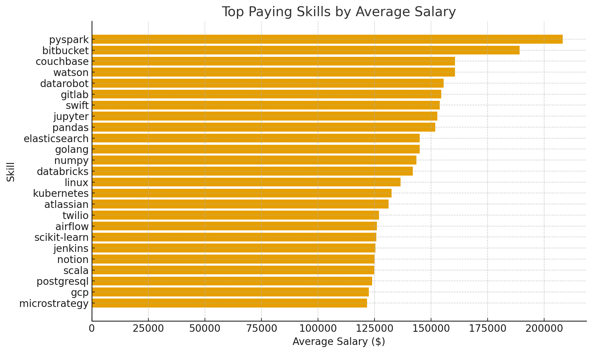

# Introduction
Dive into the data job market! Focusing on data analyst roles, this project explores top-paying jobs, in-demans skills, and where high demand meets high salary in data analytics.

SQL queries? Check them out here: [project_sql folder](/project_sql/).

# Background
Driven by a quest to navigate the data analyst job market more effectively, this project was born from a desire to pinpoint top-paid and in-demand skills, streamlining others work to find optimal jobs.

Data hails from the [SQL Course](https://lukebarousse.com/sql). It's packed with insights on job titles, salaries, locations, and essential skills.

### The questions I wanted to answer through my SQL queries were:

1. What are the top-paying data analyst jobs?
2. What skills are required for these top-paying jobs?
3. What skills are most in demand for data analysts?
4. Which skills are associated with higher salaries?
5. What are the most optimal skills to learn?

# Tools I used
For my deep dive into the data analyst job market, I harnessed the power of several key tools:

- **SQL:** The backbone of my analysis, allowing me to query the database and unearth critical insights.
- **PostgreSQL:** The chosen database management system, ideal for handling the job posting data.
- **Visual Studio Code:** My go-to for database management and executing SQL queries.
- **Git & GitHub:** Essential for version control and sharing my SQL scripts and analysis, ensuring collaboration and project tracking.

# The Analysis
Each query for this project aimed at investigating specific aspects of the data analyst job market.
Here's how I approached each question:

### 1. Top-Paying Data Analyst Jobs
To identify the highest-paying roles, I filtered data analyst positions by average yearly salary and location, focusing on remote jobs. This query highlights the high paying opportunities in the field.

```sql
SELECT
    job_id,
    job_title,
    job_location,
    job_schedule_type,
    salary_year_avg,
    job_posted_date,
    name AS company_name
FROM job_postings_fact
LEFT JOIN company_dim ON job_postings_fact.company_id = company_dim.company_id
WHERE job_title_short = 'Data Analyst' AND job_location = 'Anywhere' AND salary_year_avg IS NOT NULL
ORDER BY salary_year_avg DESC
LIMIT 10;
```
Here's the breakdown of the top data analyst jobs in 2023:
- **Wide Salary Range:** Top 10 paying data analyst roles span from $184,000 to $650,000, indicating significant salary potential in the field.
- **Diverse Employers:** Companies like SmartAsset, Meta, and AT&T are among those offering high salaries, showing a broad interest across different industries.
- **Job Title Variety:** There's a high diversity in job titles, from Data Analyst to Director of Analytics, reflecting varied roles and specialisations within data analytics.



*Bar graph visualising the salary for the top 10 salaries for data analysts; ChatGPT generated this graph from my SQL query results*


### 2. Skills for Top Paying Jobs
To understand what skills are required for the top-paying jobs, I joined the job postings with the skills data, providing insights into what employers value for high-compensation roles.
```sql
WITH top_paying_jobs AS (
    SELECT
        job_id,
        job_title,
        salary_year_avg,
        name AS company_name
    FROM job_postings_fact
    LEFT JOIN company_dim ON job_postings_fact.company_id = company_dim.company_id
    WHERE 
        job_title_short = 'Data Analyst' AND 
        job_location = 'Anywhere' AND 
        salary_year_avg IS NOT NULL
    ORDER BY salary_year_avg DESC
    LIMIT 10
)

SELECT
    top_paying_jobs.*,
    skills
FROM top_paying_jobs
INNER JOIN skills_job_dim ON top_paying_jobs.job_id = skills_job_dim.job_id
INNER JOIN skills_dim ON skills_job_dim.skill_id = skills_dim.skill_id
ORDER BY salary_year_avg DESC
```
Analysing the breakdown of the most demanded skills for the top 10 highest paying data analyst jobs in 2023 we can clearly see some trends:
- **SQL** is leading with a bold count of 8.
- **Python** follows closely with a count of 7.
- **Tableau** is also highly sought after, with a count of 6.
Other skills like **R**, **Snowflake**, **Pandas**, and **Excel** show varying degrees of demand.


*Bar graph visualising the top 10 skills for data analysts; ChatGPT generated this graph from my SQL query results*

### 3. Top In-Demand Skills
So, what are the top demanded skills for data analyst roles?

```sql
SELECT
    skills,
    COUNT(skills_job_dim.job_id) AS demand_count
FROM job_postings_fact
INNER JOIN skills_job_dim ON job_postings_fact.job_id = skills_job_dim.job_id
INNER JOIN skills_dim ON skills_job_dim.skill_id = skills_dim.skill_id
WHERE 
    job_title_short = 'Data Analyst' AND
    job_work_from_home = TRUE
GROUP BY skills
ORDER BY demand_count DESC
LIMIT 5
```
- As shown, **SQL** clearly dominates the stage with the highest ammount of job postings asking for it, while **Excel** still goes strong in second, followed by **Python** in third and in fourth and fifth place the two most well-known visualisation tools, **Tableau** and **Power B.I.**.


*Bar graph visualising the top demanded skills for data analyst postings; ChatGPT generated this graph from my SQL query results*

### 4. Top Paying Skills
Looking at the average salary in all data jobs, what are the top paying skills that one should look out for in order to maximize personal revenue?

```sql
SELECT
    skills,
    ROUND(AVG(salary_year_avg), 0) AS avg_salary
FROM job_postings_fact
INNER JOIN skills_job_dim ON job_postings_fact.job_id = skills_job_dim.job_id
INNER JOIN skills_dim ON skills_job_dim.skill_id = skills_dim.skill_id
WHERE 
    job_title_short = 'Data Analyst' AND
    salary_year_avg IS NOT NULL AND
    job_work_from_home = TRUE
GROUP BY skills
ORDER BY avg_salary DESC
LIMIT 25
```
The values range from around $150,000 to over $200,000 — placing these firmly in the top percentile of data-related roles.

- **PySpark** leads by quite a significant margin ($19K above the next skill), indicating the high demand for big data processing and distributed computing expertise.

- **Bitbucket**, primarily a DevOps and version control tool, coming in second suggests that data engineering workflows and CI/CD integration are valued skills within data analytics teams.

- **Couchbase** and **Watson** reflect the rise of NoSQL databases and AI/ML integration respectively.

- **DataRobot**, an automated machine learning platform, rounds out the top five — showing employers reward familiarity with automation and model deployment tools.

Other skills are shown for elucidation purposes and for us to be able to place a reasonable minimum and maximum average salary value comparison by skill.


*Bar graph visualising the top demanded skills for data analyst postings; ChatGPT generated this graph from my SQL query results*

### 5. Optimal Skills
In order to "min-max" the search for the perfect job in terms of both skill demand AND average salary we need to go deeper...

```sql
WITH skills_demand AS (
    SELECT
        skills_dim.skill_id,
        skills_dim.skills,
        COUNT(skills_job_dim.job_id) AS demand_count
    FROM job_postings_fact
    INNER JOIN skills_job_dim ON job_postings_fact.job_id = skills_job_dim.job_id
    INNER JOIN skills_dim ON skills_job_dim.skill_id = skills_dim.skill_id
    WHERE 
        job_title_short = 'Data Analyst' AND
        salary_year_avg IS NOT NULL AND
        job_work_from_home = TRUE
    GROUP BY skills_dim.skill_id
), average_salary AS (
    SELECT
        skills_job_dim.skill_id,
        ROUND(AVG(salary_year_avg), 0) AS avg_salary
    FROM job_postings_fact
    INNER JOIN skills_job_dim ON job_postings_fact.job_id = skills_job_dim.job_id
    INNER JOIN skills_dim ON skills_job_dim.skill_id = skills_dim.skill_id
    WHERE 
        job_title_short = 'Data Analyst' AND
        salary_year_avg IS NOT NULL AND
        job_work_from_home = TRUE
    GROUP BY skills_job_dim.skill_id
)

SELECT
    skills_demand.skill_id,
    skills_demand.skills,
    demand_count,
    avg_salary
FROM skills_demand
INNER JOIN average_salary ON skills_demand.skill_id = average_salary.skill_id
WHERE demand_count > 10
ORDER BY 
    avg_salary DESC,
    demand_count DESC
LIMIT 25
```
We can see that hybrid profiles are clearly in the win here. Skills that bridge software engineering (**Go**) and cloud analytics (**Snowflake, Azure**) tend to command higher salaries and demand.

Employers value candidates who can operate both traditional big data systems such as **Hadoop** and modern cloud-native tools like **Snowflake**.

The inclusion of **Confluence** shows that collaboration and documentation platforms are essential to large-scale data projects.

Career takeaway: For professionals aiming to maximize employability, learning **Snowflake** or **Azure** offers the best mix of high demand and stable salary, while adding **Go** could significantly raise earning potential in the long run.

|skills    |demand_count| avg_salary|
|:--------:|:----------:|:---------:|
|  go      |    27      |   115320  |
|confluence|	11      |	114210  |
|hadoop    |	22      |	113193  |
|snowflake |	37      |	112948  |
|azure     |	34      |	111225  |


# What I Learned
Throughout this adventure I've turbocharged my SQL toolkit with some serious firepower:

- **Compley Query Crafting:** Mastered the art of advanced SQL, merging tables like a pro and wielding WITH clauses for ninja-level temp table maneuvers.
- **Data Aggregation:** Got cozy with GROUP BY and turned aggregate functions like COUNT() and AVG() into my data-summarizing sidekicks.
- **Analytical Wizardry:** Levelled up my real-world puzzle-solving skills, turning questions into actionable, insightful SQL queries.

# Conclusions

### Insights
From the analysis, several general insights emerged:

1. **Top-Paying Data Analyst Jobs:** The highest-paying jobs for data analysts that allow remote work offer a wide rande of salaries, the highest at $650,000!
2. **Skills for Top-Paying Jobs:** High-paying data analyst jobs require advanced proficiency in SQL, suggesting it's a critical skill for earning a top salary.
3. **Most In-Demand Skills:** SQL is also the most demanded skill in the data analyst job market, thus making it essential for job seekers.
4. **Skills With Higher Salaries:** Specialised skills, such as SVN and Solidity, are associated with the highest average salaries, indicating a premium on niche expertise.
5. **Optimal Skills for Job Market Value:** SQL leads in demand and offers for a high average salary, positioning it as one of the most optimal skills for data analysts to learn to maximise their market value.

### Closing Thoughts

This project enhanced my SQL skills and provided valuable insights into the data analyst job market. The findings from the analysis serve as a guide to prioritizing skill development and job search efforts. Aspiring data analysts can better position themselves in a competitive job market by focusing on high-demand, high salary skills. This exploration highlights the importance of continuous learning and adaptation to emerging trends in the field of data analytics.
